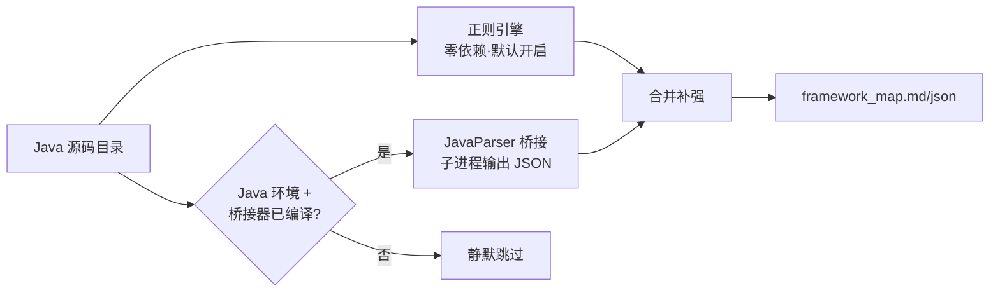

# 我用 200 行 Java 给 Python 静态分析器开了挂：纯正则搞不定的泛型，JavaParser 兜底

> 一个零依赖的 Python 正则分析器，硬刚了 28 个真实 Spring Boot 项目。直到遇到 DDD 架构，逆向索引只剩 13 条——我决定请 JavaParser 下场，但只让它当"备胎"。这篇是完整的架构设计 + 4 个真实踩坑记录。

## 📌 先说背景

事情是这样的。

我在做一个开源项目 [ContextGate](https://github.com/23512478/ContextGate)：丢给它一个 Spring Boot + MyBatis 项目，它能吐出一张完整的调用链地图——

```
HTTP 路由 → Controller → Service → Mapper → SQL → 表/列
```

这张图是给 AI 编程工具（Cursor / Trae / Claude Code）用的。AI 有了它，改一个字段就知道会影响哪些接口，不用把整个仓库塞进上下文。

**最开始我给自己立了个 flag：零依赖，纯正则，一个 Python 文件拷走就能跑。**

前七轮训练，28 个真实项目（RuoYi、mall、litemall、yudao……）跑下来，效果其实相当能打。直到第七轮拉了 7 个新项目，AgileBoot 给了我一巴掌：

| 项目 | 架构风格 | Mapper 逆向索引 |
| --- | --- | --- |
| RuoYi-Cloud | 标准三层 | 正常 |
| SpringBlade | 标准三层 | 正常 |
| mall4j | 标准三层 | 正常 |
| **AgileBoot** | **DDD 分层** | **13 条**（明显偏少） |

同一个量级的项目，DDD 架构直接腰斩还多。我打开源码一看，好家伙，链路长这样：

```java
// Controller 调 ApplicationService
userAppService.edit(userEditDTO);

// ApplicationService 调工厂
UserModel userModel = userModelFactory.load(dto.getUserId());

// 工厂 new 出领域对象
return new UserModel(userModel, userService, roleService);

// 领域对象（注意：它不是 Spring Bean！）里调 mapper
public void edit(...) {
    this.sysUserService.updateById(...);  // sysUserService 是构造器塞进来的
}
```

正则分析器在 `new UserModel(...)` 这里就断了——它不知道这个对象内部持有的 `sysUserService` 字段是什么类型。**这不是某条规则没写，是字符级正则的能力天花板。**

是时候把真 AST 请进来了。但怎么请，我纠结了挺久，这篇就是完整记录。

---

## 一、先想清楚：正则到底死在哪

很多人一说"正则解析代码"就笑，但你得先搞清楚它具体死在什么地方，才能对症下药。我总结了三个真实卡点。

### 卡点 1：嵌套泛型，字符级配对会疯

正则解析类声明，能拿到泛型实参的**原文**：

```java
// 这种简单的，正则能折：
public class OrderServiceImpl extends AbstractService<OrderMapper, Order> {}

// 遇到嵌套的，尖括号配对直接抓瞎：
public class XxxServiceImpl extends BaseManager<
        SuperMapper<OrderMapper>,   // M 位实参本身还带泛型
        Order
> {}
```

正则的尖括号配对是逐字符数的，嵌套两层以上，`>` 到底是哪个尖括号的闭合？它分不清。

### 卡点 2：泛型变量要沿继承链"折叠"

```java
// 基类在 jar 里，字段类型是形参 M
public class ServiceImpl<M extends BaseMapper<T>, T> {
    @Autowired
    protected M baseMapper;
}

// 子类把 M 钉死
public class OrderServiceImpl extends ServiceImpl<OrderMapper, Order> {}
```

分析基类方法体里的 `baseMapper.insert(...)` 时，`M` 是什么？得**从子类视角沿继承链做 BFS 折叠**：`M = OrderMapper`。

单层、两层我用正则 + 不动点迭代搞定了。但真实项目里中间能夹三四个泛型基类，形参还一路改名（`T → TT → M`）：

```java
Bottom extends Middle<Order>
Middle<TT> extends Base<TT>
Base<TB> extends ServiceImpl<XxxMapper<TB>, TB>
```

字符替换很容易折不干净，留个裸 `TB` 在那，链路断了。

### 卡点 3：new 出来的对象，字段归属算谁的

就是开头 AgileBoot 的例子。正则知道 `new UserModel(a, b, c)`，但构造器参数怎么赋给字段、字段类型是什么——它没有"构造函数 → 字段赋值"的数据流概念。

**共同点：这些都不是"补条规则"能解决的，是没有语法树的本质缺陷。**

---

## 二、方案选型：为什么我没有推倒重写

既然正则有天花板，最直觉的做法是重写：javaparser、tree-sitter，一步到位。我列了三个方案对比：

| 方案 | 精度 | 依赖成本 | 分发友好度 |
| --- | --- | --- | --- |
| 纯正则（现状） | 80% 场景够用 | 零依赖 | ⭐⭐⭐⭐⭐ |
| 全量重写成 AST | 最高 | 要 JDK + 一堆 jar | ⭐ |
| **正则为主 + AST 可选兜底** | 高精度场景补齐 | 想用才装 | ⭐⭐⭐⭐ |

最后选了第三个，核心理由有三条：

**1️⃣ 零依赖是这个工具的命根子。**

它是要配置到用户的 MCP 设置里的，`python xxx.py` 直接能跑和"先装 JDK、再下 4 个 jar、再 javac 编译"之间，隔着 90% 的试用流失率。

**2️⃣ AST 在标准项目里没有额外信息可补。**

这个后面有实测数据：RuoYi-Vue 开桥接前后，**调用边 1368 → 1368，零差异**。正则把套路化写法吃透后，标准三层架构根本不需要 AST。

**3️⃣ JavaParser 自己也不是银弹。**

它的符号求解器需要 classpath，项目依赖的 Spring、MyBatis jar 不在路径里，外部类型一样解不出。指望它解决一切会失望。

所以最终设计原则一句话：

> **正则是默认引擎，AST 是可选涡轮增压器。增压器坏了，车还能正常开。**

---

## 三、整体架构：两个进程，一段 JSON

先上架构图（CSDN 标配 🐶）：



### 为什么是"Java 子进程 + JSON 文件"

JavaParser 是 Java 库，Python 没法直接调。JPype、GraalVM 这些方案全都要往 Python 环境里装东西，全部否决。

最终方案土但稳到离谱：

```
JavaBridge.java（约 200 行，单文件）
    ↓ javac 编译
JavaBridge.class
    ↓ Python subprocess 调用
    输入：源码目录
    输出：临时 JSON 文件
    ↓ Python 读 JSON
合并进正则结果
```

没有服务、没有端口、没有长驻进程。分析一次跑一次，跑完即退，临时文件用完即删。

### 最关键的决策：符号求解器只配项目源码

JavaParser 真正值钱的是 `JavaSymbolSolver`——它能直接告诉你一个表达式的**声明类型**，连泛型都折好了。但它得知道"类型去哪找"：

```java
CombinedTypeSolver ts = new CombinedTypeSolver();
ts.add(new ReflectionTypeSolver(false));        // ① JDK 自带类型
for (Path p : sourceRoots) {
    ts.add(new JavaParserTypeSolver(p.toFile())); // ② 只加项目源码
}
// 注意：没有第三步！不解析 Maven 依赖的 jar！
```

故意不加 Maven classpath。这意味着：

- ✅ 项目内部类的泛型绑定、字段类型、方法调用接收者 → 能解（**正好是正则盲区**）
- ❌ `IService`、`BaseMapper` 这些外部框架类型 → 解不出，返回空

为什么外部的不要？因为框架内置行为我本来就有专门的硬编码规则（`_SERVICE_BUILTIN_MAP`：`save → insert`、`getById → selectById`……）。**桥接只补项目内部，边界清清楚楚，不做半吊子全量求解。**

### 桥接输出长这样

每个类吐一段 JSON，重点看 `resolved` 字段——这是符号求解器折完泛型后的全限定具体类型：

```json
{
  "fqn": "com.demo.controller.WidgetController",
  "extends": [{
    "raw": "BaseController",
    "args": ["WidgetService", "Widget"],
    "resolved": "com.demo.base.BaseController<com.demo.service.WidgetService, com.demo.entity.Widget>"
  }],
  "fields": [{
    "name": "service",
    "type": "S",
    "resolved": "com.demo.service.WidgetService"
  }],
  "methods": [{
    "name": "add",
    "calls": [{
      "name": "save",
      "scope": "service",
      "recv_type": "com.demo.service.WidgetService",
      "decl_type": "com.baomidou...IService"
    }]
  }]
}
```

正则要沿继承链 BFS 半天的东西，JavaParser 一行 `type.resolve().describe()` 就给了。这就是 AST 的降维打击。

---

## 四、Python 侧：三个补强点（含代码）

桥接数据**不替换**正则结果，只在正则有缺口的地方补。三个注入点：

### 补强点 1：extends 泛型实参

正则存的实参原文折不动时，用桥接的 resolved 值替换：

```python
for i, (root, args) in enumerate(cls.get("extends_heads") or []):
    for be in bc.get("extends", []):
        if _simple_of(be.get("resolved", "")) != root:
            continue
        # 桥接给出的全限定实参 → 剥成简单名
        resolved_args = [_simple_of(a) for a in _bridge_type_args(be["resolved"])]
        # 守卫：桥接自己都没解成具体类型（如 extends Base<T>），绝不替换！
        if resolved_args and not any(a in own_params for a in resolved_args):
            cls["extends_heads"][i] = (root, resolved_args)
```

⚠️ 那个 `own_params` 守卫非常重要：桥接也有解不出的时候（外部基类），这时正则的原文反而保留了更多信息，不能用垃圾覆盖。

### 补强点 2：字段类型

```python
for bf in bc.get("fields", []):
    rt = bf.get("resolved", "")
    if rt and bf["name"] in (cls.get("field_full") or {}):
        simple = _simple_of(rt)
        # Object 是求解失败的兜底值，不能要；类型必须在项目类表里
        if simple and simple != "Object" and simple in by_simple:
            cls["field_full"][bf["name"]] = simple
            cls["fields"][bf["name"]] = simple
```

这里我踩了个低级坑，后面细说。

### 补强点 3：调用接收者兜底（价值最大的一处）

分析器解析 `xxxService.save()` 这种调用，原来有两条路找接收者类型：

```
① 字段表（@Autowired 注入的字段）
② 局部变量表（new 出来的、工厂方法返回的）
   ↓ 都失败
   原来：放弃，不产边
   现在：③ 查桥接的符号求解结果
```

代码：

```python
if _BRIDGE_CALLS:
    # key = (类全限定名, 方法名, 调用scope尾段, 被调方法名)
    bt = _BRIDGE_CALLS.get((target.get("fqn", ""), mname, field, cmethod))
    if bt:
        bcls = by_simple.get(bt)
        # 接口会被归一化到实现类，枚举 implement 接口时会被误归，这里提前排掉
        final_cls = by_simple.get(impl_of.get(bt, bt))
        if (bcls and (bcls["is_mapper"] or bcls["is_service_impl"]
                      or bcls["kind"] == "interface")
                and (not final_cls or final_cls["kind"] != "enum")):
            emit(bt, cmethod, False)
```

桥接索引的 key 设计成 `(类fqn, 方法名, scope尾段, 调用名)`——`this.userService.save()` 的 scope 取尾段 `userService`，直接精确命中。

### 自动降级逻辑

调用桥接的包了一层完整的容错，任何一步挂了都当桥接不存在：

```python
def _run_java_bridge(root):
    if os.environ.get("CG_NO_BRIDGE"):    # 手动开关
        return None
    if not os.path.isfile(...JavaBridge.class):  # 没装
        return None
    try:
        r = subprocess.run(["java", "-cp", cp, "JavaBridge", root, tmp.name],
                           capture_output=True, timeout=600)
        if r.returncode != 0:
            return None                   # 跑挂了
        return json.load(...)
    except Exception:
        return None                       # 超时、没 java、JSON 坏了……全兜底
```

**用户视角：装了桥接输出变准，没装一切照旧，零学习成本。**

---

## 五、踩坑实录 🕳️（本文最干的部分）

桥接不是开了开关就完事，第一版在 mall4j 上直接给我灌了 158 条假边。四个坑，每个都是"现象 → 排查 → 根因 → 解决"。

### 坑 1：DTO 的 getter 全被当成了调用链

**现象**：mall4j 开桥接，调用边 864 → 1021，暴涨 158 条。还挺高兴，定睛一看新增的是这些玩意：

```
AddrController#addAddr           → AddrParam#getAddrId
BasketServiceImpl#addShopCartItem → ChangeShopCartParam#getCount
BasketServiceImpl#addShopCartItem → ChangeShopCartParam#getSkuId
AdminLoginController#login       → CaptchaAuthenticationDTO#getUserName
```

**排查**：全是 `param.getXxx()`、`dto.getXxx()` 这种**数据对象的取值调用**。

**根因**：正则路径里本来有个 `local_type_ok` 过滤器，实体类、Example 类一律不收。但我写桥接兜底时图省事，只加了 `local_type_ok`——它拦得住实体，**拦不住 DTO/Param/VO**（这些没有 `@TableName`，在类表里就是普通类）。

**解决**：桥接兜底改成**白名单制**，只认三种类型：

```python
bcls["is_mapper"]           # Mapper 接口
or bcls["is_service_impl"]  # Service 实现类
or bcls["kind"] == "interface"  # Service 接口
```

> 💡 **教训：增强解析能力时，"多收"比"少收"危险得多。** 少收一条最多链路不完整，多收 158 条假边会让整个逆向索引和影响面分析废掉。

### 坑 2：枚举 implements 接口，被误当成 Service

**现象**：加了白名单，youlai-boot 又冒出两条：

```
Result#result → ResultCode#getCode
Result#result → ResultCode#getMsg
```

`ResultCode` 怎么看都不像 Service。打开源码：

```java
public enum ResultCode implements IResultCode, Serializable {
    SUCCESS(200, "成功"), ...
}
```

**根因**：链路是这样误判的——桥接解出接收者是接口 `IResultCode`（白名单放行）→ `emit` 里有个"接口归一化到实现类"的逻辑（为了让调用图节点只建在 class 上）→ 而 `impl_of` 映射表构造时，**枚举 implements 接口也被当成了实现关系** → 边最终落到枚举 `ResultCode` 上。

**解决**：emit 前检查**归一化之后**的目标类，是枚举直接丢弃：

```python
final_cls = by_simple.get(impl_of.get(bt, bt))
if ... and (not final_cls or final_cls["kind"] != "enum"):
    emit(...)
```

注意必须查归一化**之后**——查之前的接口类型是查不出枚举的，我第一版就改错了位置。

### 坑 3：改错字段，改了个寂寞

**现象**：补强点 2（字段类型）写完，mall4j 结果纹丝不动。

**排查**：打断点一看，桥接数据明明改成功了，`fields` 字典里全是正确类型。但调用图没变。

**根因**：分析器实际消费字段类型的函数 `field_type_of`，读的是 **`field_full`**（保留泛型原貌的字段表），我改的是 **`fields`**（简单名字段表）。两个字典长得太像，改错了一个。

```python
# field_type_of 的真实数据源：
full = (c2.get("field_full") or {}).get(fname)
```

**解决**：两个字典一起改。这种坑没有技术含量，纯粹是代码读得不够细，但它浪费了我二十分钟，放这里给大家提个醒。

### 坑 4：一条"丢失"的边，其实是正则错了被纠正

**现象**：桥接前后对比，mall4j 有一条边"丢了"：

```
ProdCommController#getProdCommPage
  桥接前: → ProdCommServiceImpl#getProdCommDtoPageByUserId
  桥接后: → ProdCommServiceImpl#getProdCommPage
```

第一反应：桥接搞回归了？查 Controller 源码：

```java
@GetMapping("/page")
public ServerResponseEntity<IPage<ProdComm>> getProdCommPage(PageParam page, ProdComm prodComm) {
    return ServerResponseEntity.success(
        prodCommService.getProdCommPage(page, prodComm)  // 调的明明是 getProdCommPage！
    );
}
```

**根因**：`ProdCommServiceImpl` 里有 4 个重载方法（`getProdCommPage`、`getProdCommDtoPageByUserId`、`getProdCommDtoPageByProdId`……），正则按方法名匹配时张冠李戴了。桥接用符号求解，**精确指到了正确的重载**。

**结论**：这不是回归，是修对了。但如果只看"边数 -1"的汇总数字，很容易误判成 bug 然后回滚。

> 💡 **教训：对比分析结果不能只数数量，每条差异都要回源码核实。**

---

## 六、实测：到底什么项目该装桥接

四个项目，桥接前 vs 桥接后：

| 项目 | 架构 | 调用边变化 | 逆向索引 | 结论 |
| --- | --- | --- | --- | --- |
| **AgileBoot** | DDD 分层 | +4，纠正 3 条误指 | **13 → 36** 🔥 | 提升最大 |
| mall4j | 标准三层+MP | +1，纠正 1 条重载误指 | 240 | 小幅修正 |
| RuoYi-Vue | 标准三层 | **0** | 155 | 零差异 |
| youlai-boot | 标准三层 | **0**（修完噪音后） | 74 | 零差异 |

规律一目了然：

> **架构越标准，桥接越没用；泛型和分层玩得越花，桥接越值钱。**

- 标准三层（Controller/Service/Mapper 清晰分层，注入字段都是简单类型）：正则第一条路径就命中，桥接全程看戏
- DDD / 多层泛型基类 / 工厂 new 领域对象：正则的三个天花板全踩中，桥接降维打击

这恰好验证了"可选增强"的设计——**不给 80% 的标准项目增加任何成本，只在 20% 的硬核场景发力。**

---

## 七、怎么用（30 秒上手）

桥接是**自动检测**的，不需要改任何配置。

**第一次使用**，跑安装脚本（从阿里云镜像拉 4 个 jar 共约 5MB + javac 编译，jar 不进 git）：

```bash
python analyzer/java-bridge/setup.py
```

**然后正常用就行**，开启时会有提示：

```
JavaParser 桥接已启用（388 类，1971 条调用接收者）
[OK] 扫描 385 个 Java 文件，385 个类，203 条路由
```

**想关掉**（比如排查问题要对比纯正则结果）：

```bash
# Windows
set CG_NO_BRIDGE=1
# Linux / Mac
export CG_NO_BRIDGE=1
```

环境要求：编译要 JDK（有 `javac`），运行只要 JRE，Java 8+ 即可。

---

## 八、老老实实说边界

桥接缩小了盲区，没消灭盲区。剩下四个搞不定的：

1. **外部 jar 里的类型还是解不出**——故意不配 Maven classpath。重度依赖某个陌生 starter 泛型基类的项目，桥接帮不上
2. **`new` 对象的构造参数数据流不追**——AgileBoot 的 `new UserModel(a, b, c)` 里参数如何赋给字段，目前只靠字段声明类型补，构造器实参传播不做，极端情况还是断
3. **有性能成本**——mall4j（385 文件）桥接多花十几秒；halo 那种 1000+ 文件更慢，子进程启动 + 全量符号求解的固有开销
4. **要本机有 Java**——没有 JDK 的机器只能用纯正则档（功能不受影响，只是没有增强）

这些都写进了项目的诚实清单，不装懂。

---

## 九、一点感想

这轮做完，我对"正则 vs AST"的体感清晰了很多：

**它们不是替代关系，是成本和精度的两个档位。**

- 正则档：零依赖、毫秒级、80% 场景够用，代价是遇到邪道写法要一个个补规则
- AST 档：精确、有作用域和符号信息，代价是环境、依赖、性能开销

很多工具的做法是"新一代推翻旧一代"，AST 党嘲笑正则党原始。但做完这轮我的体会是：**用户不在乎你用什么技术，只在乎拷过去能不能跑、跑出来准不准。**

所以 ContextGate 把两个档位都做进去：默认低档保零门槛，环境允许时自动升高档补盲区，升不上去绝不影响低档。用户甚至不需要知道这套机制存在——跑一把，输出变准了，就行。

代码全在这：[github.com/23512478/ContextGate](https://github.com/23512478/ContextGate)（MIT 协议），桥接器就一个 200 行的 Java 文件，感兴趣可以直接看源码。

- 你的项目是 DDD / 泛型基类乱飞的：装桥接跑一把，看看逆向索引涨多少
- 你的项目是标准三层：也欢迎跑一把验证"零差异"——**不产生噪音边和提升覆盖率，同样重要**

漏报误报提 issue，附一小段源码就行。

---

**如果觉得有收获，点个赞 👍 收个藏 ⭐ 关个注，不迷路。**
**有疑问或者不同意见，评论区见～**
