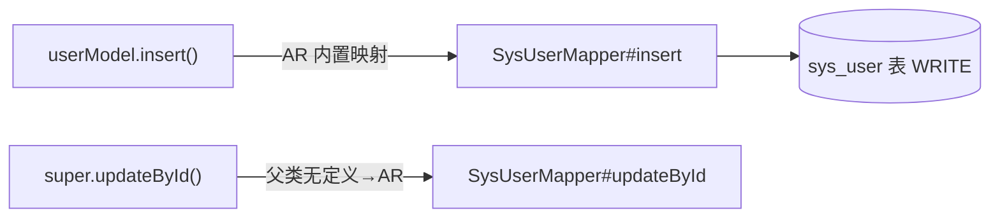

# 静态分析器硬刚 DDD 和 WebFlux：user.insert() 没经过 Mapper、154 条路由连注解都没有

> ContextGate 第八轮。诚实清单上还剩四个硬骨头：MyBatis-Plus ActiveRecord、充血领域模型、WebFlux 函数式路由、桥接器性能。这轮一个没躲，全啃了。AgileBoot 逆向索引 36→51，halo 路由 0→154，桥接二次运行 22 秒→0.9 秒，十个真实项目回归零变化。完整踩坑记录在这。

## 📌 这轮要解决什么

先快速回顾下 [ContextGate](https://github.com/23512478/ContextGate) 是干嘛的：丢给它一个 Spring Boot + MyBatis 项目，它静态分析出一张调用链地图——

```
HTTP 路由 → Controller → Service → Mapper → SQL → 表/列
```

给 AI 编程工具用的：改一个字段前，先查这张图就知道炸哪些接口，不用把整个仓库塞进上下文。

前七轮做完后，我在 README 的「诚实清单」里老老实实记了四个搞不定的边界：

1. **MyBatis-Plus ActiveRecord 模式**：实体继承 `Model<T>`，直接 `user.insert()` 落库，调用图里压根没有 Mapper 的影子
2. **充血领域模型**：DDD 项目的领域对象不是 Spring Bean，还会被误判表名
3. **WebFlux 函数式路由**：路由不是 `@GetMapping` 注解锁的，是 `RouterFunctions.route()` 在代码里串出来的
4. **桥接器每次跑都要拉起 Java 进程全量 AST 解析**，大项目二十几秒，刷新体验肉疼

这轮四个一起办。外加一个赠品：让桥接器认识 Maven 依赖 jar（v0.3 博客里亲口承认"故意不配 classpath"，这轮把flag拔了）。

---

## 一、ActiveRecord：`user.insert()` 到底调了谁

### 现象：链路终点是空气

AgileBoot 是 DDD 架构，保存用户的代码长这样：

```java
// 领域对象 UserModel 继承了 MyBatis-Plus 的 Model
public class UserModel extends UserEntity {

    public void insertUser() {
        // 没有 mapper 字段、没有 service 注入，自己就把库写了
        this.insert();
    }
}
```

`insert()` 这个方法**不在项目源码里**，它在 MyBatis-Plus jar 包的 `com.baomidou.mybatisplus.extension.activerecord.Model` 基类里，源码翻成人话是：

```java
public boolean insert() {
    return SqlHelper.retBool(getBaseMapper().insert(entity));
}
```

也就是说，`user.insert()` 语义上**等价于 `sysUserMapper.insert(user)`**——但静态文本里既没有 mapper 变量，也没有方法定义。纯正则连"这个调用存在"都看不到，更别说接到表上。

### 解法：双头确认 + 内置方法映射表

第一步得先认出"这个类是 AR 实体"。只看 extends 名字不行（叫 Model 的类多了），我加了**双头确认**：

- import 了 `com.baomidou.mybatisplus.extension.activerecord.Model`
- 且 `extends Model<...>`

两个条件同时满足才打标，杜绝误伤。

然后维护一张内置方法映射表，AR 基类的方法一对一映射到 `BaseMapper` 同名方法：

```python
_AR_BUILTIN_MAP = {
    "insert": "insert",          # 写
    "updateById": "updateById",  # 写
    "deleteById": "deleteById",  # 写
    "selectById": "selectById",  # 读
    "selectList": "selectList",  # 读
    "saveOrUpdate": "insertOrUpdate",
    ...
}
```

调用图构建时，方法名在项目内找不到定义、但当前类是 AR 实体——就合成一条到本实体对应 Mapper 的边，写方法标 WRITE。

`super.insert()` 这种写法也得认：项目内父类有同名方法就接到父类真实方法（self 边），父类没有、名字是 AR 内置的，照样落到 mapper。



---

## 二、充血模型：比断链更恶心的是"假数据"

DDD 项目的领域对象（domain 包下的充血模型）带来两个新坑，第二个尤其阴。

### 坑 1：`UserModel` 被推断成表 `user_model`

分析器原来有个包名启发式：类放在 `entity/model/domain` 包下、又没标 `@TableName`，就按类名蛇形推表名。

在标准三层里这招很好用。但在 DDD 项目里：

```
UserEntity（@TableName("sys_user")）
    └── UserModel extends UserEntity   ← 领域对象，在 domain 包
```

`UserModel` 被包名启发式推成了表 **`user_model`**——这张表在数据库里根本不存在！更糟的是，它和真身 `sys_user` 同时出现在地图里，逆向索引按表聚合，数据全劈叉了。

解法是预计算阶段做两件事：

1. **沿单继承链找显式 `@TableName` 祖先**：类自己没标表名，但祖先是显式标的，继承祖先的表名
2. **持有协作者字段的领域对象撤掉表名**：一个类的字段类型里出现了 mapper/service/interface，或者字段名匹配 `(Service|Factory|Manager|Repository|Handler|Client)$` 这类协作者命名——它是干业务的领域对象，不是行映射实体，表名直接撤掉，也不进实体列表

### 坑 2：Lombok 生成的 getter 灌爆调用图

表名修好后，另一坨东西冒了出来：`UserModel#getUserId()`、`UserModel#getUsername()`……几十个 getter 全被收成了调用边。

这些方法在源码里**根本没有方法体**——Lombok 的 `@Data` 编译期才生成。但桥接器（JavaParser 真 AST + 符号求解）把它们当真实方法解析出来了，接收者类型又恰好是领域对象，白名单一放行，噪音全进来了。

这里得拿捏一个分寸：领域对象上的调用**不能全杀**（`insertUser()` 是真业务方法，要留），也不能全放（getter 是噪音）。最后的规则——只放行两类：

- 继承链上**真实声明**的方法（源码里有方法体的）
- AR 内置方法（`insert/updateById/...`）

```python
def domain_call_ok(ftype, cmethod):
    # 领域对象只放行：继承链真实方法 + AR 内置
    # Lombok getter/setter？源码里没方法体，不收
```

字段注入、局部变量、桥接兜底三条发射路径统一接这个闸。

### 打通后的链路

最终 AgileBoot 上的完整链路：

```
POST /system/users
  → UserApplicationService#addUser
    → UserModelFactory#create
      → UserModel#insert
        → SysUserMapper#insert   WRITE ✅
```

逆向索引 36 → **51**。`PUT /system/users/{userId}` 到 `updateById` 同理可达。

---

## 三、WebFlux：halo 项目 154 条路由集体"消失"

### 现象：注解扫描器在 WebFlux 项目里抓瞎

拿 halo（一个知名开源博客系统，Spring WebFlux 技术栈）跑分析，路由数是 **0**。

不是分析器崩了，是人家压根不用注解式路由。WebFlux 的函数式端点长这样：

```java
@Bean
RouterFunction<ServerResponse> routes() {
    return RouterFunctions.route()
        .GET("/tags", this::listTag)
        .POST("/tags", this::createTag)
        .build();
}
```

或者 `andRoute` 谓词组合风格：

```java
return RouterFunctions.route(
        RequestPredicates.GET("/tags").and(RequestPredicates.accept(...)),
        tagHandler::list)
    .andRoute(RequestPredicates.POST("/tags"), tagHandler::create);
```

路径在字符串里、HTTP 方法在链式调用的方法名里、handler 是方法引用——三件套全是运行时拼的。

### 解法：两条正则 + 入口约定

我写了两套匹配：

1. **链式 DSL**：`.VERB("path", [obj::]handler[, ...])`，VERB 限 GET/POST/PUT/DELETE/PATCH
2. **谓词式**：`route/andRoute(RequestPredicates.VERB("path"), ..., handler)`

入口的判断也得想清楚：什么方法该扫函数式路由？——返回 `RouterFunction`、或者方法体里出现 `RouterFunctions.route` / `RouteBuilder.route()` 的。

handler 是方法引用时要分两种：

- `this::listTag` / `tagHandler::list`：controller 落到方法引用的接收者类型
- **字段引用**：字段类型才是真正的 handler 类，controller 记在当前类，逆向索引按 `(controller, handler)` 双键匹配图节点

### 最绕的前缀：`/apis/{groupVersion}` 是怎么破案的

halo 的自定义端点还有个魔法：类上只有一句 `implements CustomEndpoint`，路径前缀 `/apis/api.console.halo.run/v1alpha1` 到底哪来的？

静态分析不能猜。我去翻了 halo 的框架源码，在 `CustomEndpointsBuilder.java` 里找到了注册逻辑：

```java
// 框架里拼前缀的真实代码
RequestPredicates.path("/apis/" + gv)
```

默认 `groupVersion = api.console.halo.run/v1alpha1`，而端点类可以用 `GroupVersion.parseAPIVersion("console.api.storage.halo.run/v1alpha1")` 覆盖。规则就按框架真实行为实现：默认值 + 本类覆盖检测。

结果：halo 路由 0 → **154**，比如：

```
GET  /apis/api.console.halo.run/v1alpha1/tags   → TagEndpoint#listTag ✅
GET  /apis/console.api.storage.halo.run/v1alpha1/policies（自定义 groupVersion）✅
```

---

## 四、工程向：22 秒的桥接，二次运行 0.9 秒

### 缓存：文件没变就别再解析一遍

v0.3 的桥接器每次分析都要：拉起 JVM → JavaParser 解析全部 .java → 符号求解 → 输出 JSON。AgileBoot（273 文件）一次 **22.3 秒**。

但大多数"刷新地图"发生在什么场景？你只改了一两个文件，甚至只是让 AI 再查一次。全量重算纯浪费。

做法是项目指纹：遍历项目所有 .java，收集 `(相对路径, mtime_ns, 文件大小)` 三元组，排序后 SHA1：

```python
def _bridge_fingerprint(root):
    entries = []
    for ...os.walk(root)...:
        entries.append((relpath, st.st_mtime_ns, st.st_size))
    entries.sort()
    h = hashlib.sha1()
    h.update(b"cg-bridge-v2\n")   # 桥接输出格式版本，改了格式旧缓存自动废
    ...
```

任何文件的增、删、改都会改变指纹；没变就直接复用上次的 AST JSON。缓存文件放在分析器自己的 `java-bridge/cache/` 下（`.gitignore` 已排除），**不往被分析项目里吐任何东西**。

实测：AgileBoot 首次 22.3 秒，二次 **0.88 秒**。想强制重跑设 `CG_NO_CACHE=1`。

### Maven classpath：让桥接器认识 jar 里的 Spring

v0.3 博客里我写过桥接器"故意不配 Maven classpath"——因为解析项目内部泛型有源码就够了。但有些外部基类类型（Spring/MP 的注解、接口）解不出，始终是个缺口。这轮补上，原则不变：**best-effort，失败零影响**。

真正写起来发现版本解析才是工作量：

```xml
<!-- 依赖本身不写版本 -->
<dependency>
    <groupId>org.springframework.boot</groupId>
    <artifactId>spring-boot-starter-web</artifactId>
</dependency>

<!-- 版本在哪？三种可能 -->
<!-- ① 本 pom 的 properties 占位：${spring.boot.version} -->
<!-- ② 父 pom 的 dependencyManagement（spring-boot-starter-parent） -->
<!-- ③ import 进来的 BOM（spring-boot-dependencies） -->
```

桥接器（单文件 Java，零 Maven 依赖）现在会：

1. 扫项目内所有 `pom.xml`，收集 `${properties}` 占位和真实依赖
2. 解析 `dependencyManagement` 和 import BOM
3. **递归 parent 继承链**：去 `~/.m2/repository` 读父 pom（Spring Boot 项目的版本几乎全在 `spring-boot-dependencies` 这条链上），BOM 还能链式 import 别的 BOM
4. 按 `group/artifact/version` 拼出本地 jar 路径，挂成 `JarTypeSolver`

占位符可能等父 pom 的属性才能解开，所以待读 pom 走队列，解不动的下一轮再试，无进展才退出。

仓库位置按 `CG_M2_REPO` 环境变量 → `~/.m2/settings.xml` 的 `localRepository` → 默认 `~/.m2/repository` 依次找。**没装 Maven、依赖没下载过、Gradle 项目——全部静默跳过，分析照常。**

想临时关掉 Maven jar 参与（比如比对有无 Maven 的结果），设 `CG_NO_MAVEN=1`。

### 符号求解并行：yudao 6482 文件的对照实验

桥接器做完 jar 挂载、多线程化后，拿 yudao-cloud（6482 个 Java 文件、40 个模块）做了一次对照：

| 模式 | 线程数 | 耗时 |
| --- | --- | --- |
| 单线程 + 无 Maven jar | 1 | >9 分钟没跑完，手动停了 |
| 32 线程（common pool 拉满）+ 无 jar | 31 | >9 分钟没跑完 |
| 8 线程 + 无 Maven jar | 8 | **1128 秒跑完，parsed=6472 failed=0** |
| 8 线程 + 挂 Maven jar | 8 | 超过当时 600 秒子进程超时，没跑完 |

两个关键观察：

1. **线程数不是越多越好**。JavaParserTypeSolver 内部有按路径缓存（`foundTypes`/`parsedFiles`/`parsedDirectories`），高并发时锁竞争和重复求解反而把 CPU 打满——32 线程比 8 线程慢得多。所以桥接器把并发数固定为 8（`CG_BRIDGE_THREADS` 可调），用独立 ForkJoinPool 而不是默认 common pool。
2. **Maven jar 对大项目是真实开销**。mall4j（385 文件）挂 jar 无感；yudao 这种 6482 文件、几百个依赖 jar 的项目，挂 jar 后符号求解要对 jar 字节码做类型解析，耗时直接超过原来写死的 600 秒子进程超时——桥接被杀，静默回退纯正则。

第二点直接逼出了一个修复：**超时时间不能写死**。现在子进程超时默认 1800 秒（实测 1128 秒跑完有余量），`CG_BRIDGE_TIMEOUT` 可调；顺手修了超时/失败时临时 JSON 文件残留的问题（统一 `finally` 清理）。

修完立刻实测验收，yudao 首跑完整数据：

```
JavaParser 桥接已启用（6634 类，49751 条调用接收者）
[OK] 扫描 6482 个 Java 文件，6200 个类，2999 条路由
总耗时 13 分钟，缓存 25.8MB 落盘
```

再跑第二次：

```
JavaParser 桥接缓存（6634 类，49751 条调用接收者）
[OK] 扫描 6482 个 Java 文件，6200 个类，2999 条路由
总耗时 45 秒（正则分析自身耗时，桥接零等待）
```

也就是说：大项目首跑等 13 分钟，缓存落盘后**每次刷新都是 45 秒**——13 分钟 vs 45 秒，缓存机制在大项目上的价值反而最大。对速度敏感的，`CG_NO_MAVEN=1` 先跑一版（jar 本来就只补外部类型，项目内部泛型有源码就够）。

---

## 五、实测：十个真实项目 + 一个 DDD 样板

| 项目 | 架构 | 路由数 | 变化 |
| --- | --- | --- | --- |
| demo-project | 测试夹具 | 53 | 0 |
| RuoYi-Vue | 标准三层 | 147 | 0 |
| mall4j | 标准三层 | 203 | 0 |
| litemall | 标准三层 | 219 | 0 |
| yudao-cloud | 多模块大项目（6482 文件） | 2999 | 0 |
| youlai-boot | 标准三层 | 93 | 0 |
| SpringBlade | 多模块 | 181 | 0 |
| xmall | 多模块 | 160 | 0 |
| mall | 多模块 | 246 | 0 |
| **halo** | **WebFlux** | **0 → 154** | 新增函数式路由 |
| **AgileBoot** | **DDD + AR** | 76 | 逆向索引 **36 → 51** |

数字不变就是好消息：新规则只在对应的架构形态下激活，传统项目零污染。做静态分析，**"不产生假数据"和"补到真链路"同样重要**——v0.3 那 158 条 DTO getter 假边的教训还热乎着。

---

## 六、这轮的几点体会

**1. 框架约定的"隐式程度"是分层的。** 注解是显式约定（贴在源码上），ActiveRecord 是继承约定（语义在 jar 基类里），函数式路由是 DSL 约定（语义在运行时调用链里）。越隐式，静态分析越要回到"框架源码到底干了什么"——halo 那个 `/apis/{gv}` 前缀，不靠读框架源码只能靠猜，猜出来的东西迟早害人。

**2. 静态分析要有"实体身份"的判断力。** `UserModel` 到底是一张表还是一个业务对象？同一个类名，在不同架构里身份完全不同。判据不能是单一规则（包名/注解），得是多个信号的组合：继承链上的表名注解、协作者字段、方法体真实性。

**3. 缓存是体验分水岭，但指纹设计要保守。** 用 mtime+size 而不是内容哈希（6482 个文件算内容哈希也是开销）；格式版本号写进指纹（v1→v2 自动废旧缓存，防止新代码读旧结构）；缓存绝不放进用户项目目录。

代码全在这：[github.com/23512478/ContextGate](https://github.com/23512478/ContextGate)（MIT），分析器仍是一个零依赖 Python 文件 + 一个单文件 Java 桥接器。

- 写 DDD / 用 ActiveRecord 的项目：装桥接跑一把，看 `xxx.insert()` 是不是也接上了表
- WebFlux 项目：看看函数式路由抓全了没
- 标准三层的项目：也欢迎跑一把验证"零变化"

漏报误报评论区 / issue 见，附一小段源码就行。

---

**如果觉得有收获，点个赞 👍 收个藏 ⭐ 关个注，不迷路。**
**有疑问或者不同意见，评论区见～**
